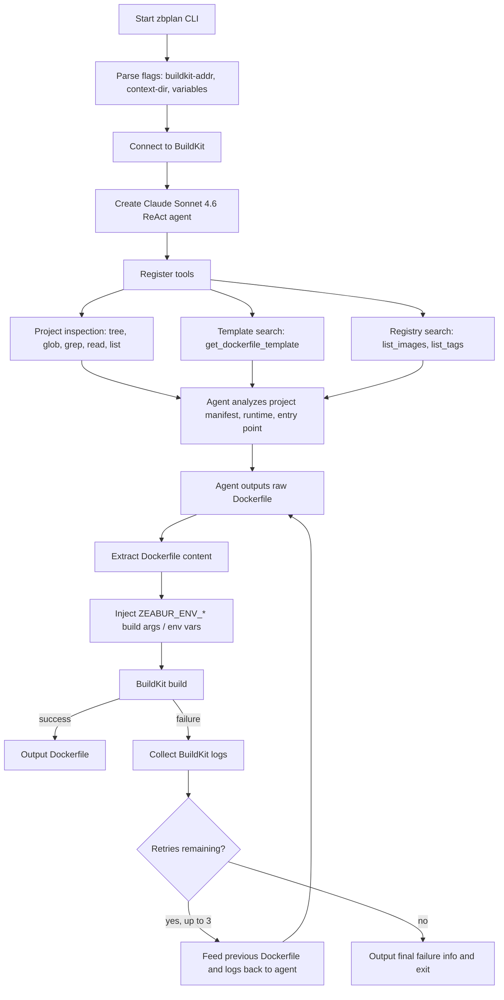

# zbplan

[繁體中文](README.zh-TW.md)

AI-powered Dockerfile generation with automatic build-and-fix iteration.

`zbplan` hands the current project to an agent for analysis. The agent searches available Dockerfile templates, Docker Hub / GHCR base images, and image tags, generates a Dockerfile, then passes it to BuildKit for an actual build. If the build fails, the BuildKit logs are fed back to the agent so it can revise the Dockerfile.

In practice, Claude Sonnet 4.6 completes Dockerfile generation in roughly 1–2 rounds at a cost of around US$0.20.

## Demo

[](https://asciinema.org/a/Tpy94oq5Re1KqPg4)

Command:

```bash
go run ./cmd/zbplan -context-dir /tmp/coscup-frontend-2026 -buildkit-addr "unix://$HOME/.lima/buildkit/sock/buildkitd.sock"
```

Tested against the [COSCUP/2026](https://github.com/coscup/2026) repository with [Zeabur AI Hub](https://zeabur.com/docs/ai-hub): total cost US$0.1946, completed in 2m48s. The project is a Nuxt.js static site; zbplan chose NGINX and correctly configured the root directory URL without any extra hints.

<details>

<summary>Dockerfile generated by zbplan</summary>

```dockerfile
FROM node:24-alpine3.22 AS builder
WORKDIR /app

RUN corepack enable pnpm

RUN --mount=type=cache,target=/root/.local/share/pnpm/store \
    --mount=type=bind,source=package.json,target=package.json \
    --mount=type=bind,source=pnpm-lock.yaml,target=pnpm-lock.yaml \
    --mount=type=bind,source=pnpm-workspace.yaml,target=pnpm-workspace.yaml \
    pnpm install --frozen-lockfile

COPY . .

RUN pnpm build

FROM nginx:1.28.3-alpine AS runtime

RUN rm /etc/nginx/conf.d/default.conf

COPY --from=builder /app/.output/public /usr/share/nginx/html/2026

RUN printf 'server {\n\
    listen 8080;\n\
    server_name _;\n\
    root /usr/share/nginx/html;\n\
\n\
    location /2026/ {\n\
        try_files $uri $uri/ /2026/index.html;\n\
    }\n\
\n\
    location = / {\n\
        return 301 /2026/;\n\
    }\n\
}\n' > /etc/nginx/conf.d/app.conf

RUN addgroup -S app && adduser -S app -G app \
    && chown -R app:app /usr/share/nginx/html \
    && chown -R app:app /var/cache/nginx \
    && touch /var/run/nginx.pid \
    && chown app:app /var/run/nginx.pid

USER app

EXPOSE 8080

CMD ["nginx", "-g", "daemon off;"]
```

</details>

## Background

Hu et al. (2025) [^1] explored a similar approach:

- Build a shared base image so agents can experiment with dependency installation on it.
- Once dependencies are installed, run unit tests to verify the environment works.
- If tests pass, generate a Dockerfile that reproduces the environment.

Zeabur plans to improve on this direction:

1. Skip the shared base and instead query the Registry API with fuzzy search to resolve versions (e.g. `ubuntu:24.04`). When uncertain, present a list of candidate versions for the AI to choose from.
2. Since Zeabur targets web services, the acceptance criterion can shift from "unit tests pass" to "the service port is reachable." This prototype uses a successful BuildKit build as the acceptance condition.
3. Use cache mounts to avoid reinstalling dependencies on each retry, while still allowing the agent to rewrite the entire Dockerfile.

## Differences from Previous zbpack

- Few-shot LLM involvement means it automatically adapts to all kinds of projects without requiring hand-written decision logic.
- The AI can search Docker Hub and `ghcr.io` for available base images, and fuzzy-search the built-in Dockerfile templates.
- AI-generated Dockerfiles are **actually built with BuildKit** to verify they compile; failures are sent back for revision.
- The AI now understands cache mounts, bind mounts, and multi-stage builds. With a properly configured BuildKit cache, dependencies only need to be fetched once.

## Flow



## Key Components

- `cmd/zbplan`: CLI entrypoint. Creates a Claude ReAct agent and runs up to 3 iterations of the generate → build → fix loop.
- `internal/plantools`: Tools exposed to the agent — project file inspection, Dockerfile template fuzzy search, registry image/tag search, and a BuildKit client wrapper.
- `internal/plantools/dockerfiles`: Built-in Dockerfile templates, currently covering Bun, Deno, FastAPI, Go, Java Gradle, Java Maven, Next.js, Node npm, Node pnpm, PHP, Python pip, Python uv, Ruby, Rust, and Static.
- `lib/registryutil`: Searches Docker Hub / GHCR images and uses fuzzy search to pick tags matching the required version.
- `lib/builder`: BuildKit builder — handles Dockerfile preprocessing, environment variable injection, build context mounting, and build progress logging.

## Usage

Provide an Anthropic API key and a reachable BuildKit server:

```bash
ZBPLAN_ANTHROPIC_API_KEY=... \
nix develop --command go run ./cmd/zbplan \
  --buildkit-addr tcp://127.0.0.1:1234 \
  --context-dir /path/to/project
```

Use `--variables KEY=value` to pass environment variables. They are injected after each `FROM` statement in the Dockerfile as `ARG ZEABUR_ENV_*` and a corresponding `ENV`.

## Development

This project uses Nix. All Go commands must run inside the dev shell:

```bash
nix develop --command go test ./...
nix develop --command go build ./...
```

Integration tests for Dockerfile templates require Docker and spin up a BuildKit container via testcontainers:

```bash
nix develop --command go test -tags=integration -timeout=30m -count=1 ./internal/plantools/
```

Add `-v` to see full BuildKit logs on failure:

```bash
nix develop --command go test -tags=integration -timeout=30m -count=1 -v ./internal/plantools/
```

[^1]: Hu, R., Peng, C., Wang, X., Xu, J., & Gao, C. (2025). Repo2Run: Automated building executable environment for code repository at scale. arXiv. https://doi.org/10.48550/arXiv.2502.13681
