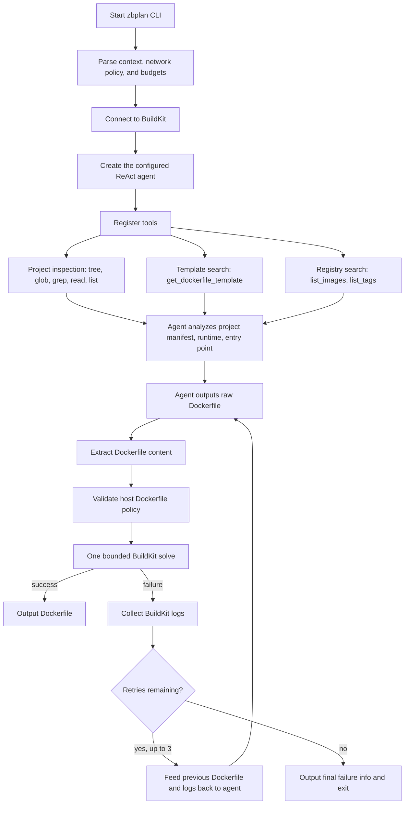

# zbplan

[繁體中文](README.zh-TW.md)

AI-powered Dockerfile generation with automatic build-and-fix iteration.

`zbplan` hands the current project to an agent for analysis. The agent searches available Dockerfile templates, Docker Hub / GHCR base images, and image tags, generates a Dockerfile, then passes it to BuildKit for an actual build. If the build fails, the BuildKit logs are fed back to the agent so it can revise the Dockerfile.

In practice, Claude Sonnet 4.6 and OpenAI GPT-5.5 completes Dockerfile generation in roughly 1–2 rounds at a cost of around US$0.20.

## Demo

[](https://asciinema.org/a/w369RBjXfHpaJjfX)

Command:

```bash
# Start buildkitd
docker run -d --name buildkitd --privileged moby/buildkit:latest

# Run zbplan
time go run ./cmd/zbplan -context-dir /Volumes/Dev/coscup/frontend-2026 -buildkit-addr "docker-container://buildkitd"
```

Tested against the [COSCUP/2026](https://github.com/coscup/2026) repository with the default GPT 5.5 configuration on [Zeabur AI Hub](https://zeabur.com/docs/ai-hub), zbplan completed the build in 2 attempts, taking 1 minute and 58.165 seconds at a total cost of US$0.1937. The project is a Nuxt.js static site, and zbplan selected [our Caddy server distribution](https://github.com/zeabur/caddy-static) and configured the 301 redirect correctly without any additional hints.

<details>

<summary>Dockerfile generated by zbplan</summary>

```dockerfile
FROM node:24.9-alpine AS builder
WORKDIR /app

ENV COREPACK_ENABLE_DOWNLOAD_PROMPT=0

RUN corepack enable pnpm

RUN --mount=type=cache,target=/root/.local/share/pnpm/store \
    --mount=type=bind,source=package.json,target=package.json \
    --mount=type=bind,source=pnpm-lock.yaml,target=pnpm-lock.yaml \
    --mount=type=bind,source=pnpm-workspace.yaml,target=pnpm-workspace.yaml \
    pnpm install --frozen-lockfile --ignore-scripts

COPY . .

ENV NITRO_PRESET=static
RUN pnpm exec nuxt prepare && pnpm build

FROM zeabur/caddy-static:2.0 AS runtime

COPY --from=builder /app/.output/public /usr/share/caddy/2026

RUN cat <<'EOF' > /usr/share/caddy/_redirects
/  /2026/  301
EOF

EXPOSE 8080
```

</details>

## Background

Hu et al. (2025) [^1] explored a similar approach:

- Build a shared base image so agents can experiment with dependency installation on it.
- Once dependencies are installed, run unit tests to verify the environment works.
- If tests pass, generate a Dockerfile that reproduces the environment.

Zeabur plans to improve on this direction:

1. Skip the shared base and instead query the Registry API with fuzzy search to resolve versions (e.g. `ubuntu:24.04`). When uncertain, present a list of candidate versions for the AI to choose from.
2. Since Zeabur targets web services, the acceptance criterion can shift from "unit tests pass" to "the service port is reachable." This prototype uses a successful BuildKit build as the acceptance condition.
3. Use cache mounts to avoid reinstalling dependencies on each retry, while still allowing the agent to rewrite the entire Dockerfile.

## Differences from Previous zbpack

- Few-shot LLM involvement means it automatically adapts to all kinds of projects without requiring hand-written decision logic.
- The AI can search Docker Hub and `ghcr.io` for available base images, and fuzzy-search the built-in Dockerfile templates.
- AI-generated Dockerfiles are **actually built with BuildKit** to verify they compile; failures are sent back for revision.
- The AI now understands cache mounts, bind mounts, and multi-stage builds. With a properly configured BuildKit cache, dependencies only need to be fetched once.

## Flow


```mermaid
flowchart TD
    A[Start zbplan CLI] --> B[Parse context, network policy, and budgets]
    B --> C[Connect to BuildKit]
    C --> D[Create the configured ReAct agent]
    D --> E[Register tools]

    E --> E1[Project inspection: tree, glob, grep, read, list]
    E --> E2[Template search: get_dockerfile_template]
    E --> E3[Registry search: list_images, list_tags]

    E1 --> F[Agent analyzes project manifest, runtime, entry point]
    E2 --> F
    E3 --> F

    F --> G[Agent outputs raw Dockerfile]
    G --> H[Extract Dockerfile content]
    H --> I[Validate host Dockerfile policy]
    I --> J[One bounded BuildKit solve]

    J -->|success| K[Output Dockerfile]
    J -->|failure| L[Collect BuildKit logs]
    L --> M{Retries remaining?}
    M -->|yes, up to 3| N[Feed previous Dockerfile and logs back to agent]
    N --> G
    M -->|no| O[Output final failure info and exit]
```

## Key Components

- `cmd/zbplan`: CLI entrypoint. Creates the configured ReAct agent and applies explicit model, tool, build, concurrency, and wall-clock budgets.
- `pkg/zbplan`: Agent orchestration and context budgeting. Individual model-visible tool results and BuildKit retry logs are capped at 12 KiB; full tool results are retained only within a byte-capped store, and only previously truncated results are compacted in older tool rounds.
  `read_tool_output` pages stay verbatim in model history and are not retained again, so paging does not evict the source from the output store.
- `internal/plantools`: Bounded tools exposed to the agent — project file inspection, Dockerfile template fuzzy search, allowlisted registry image/tag search, and a BuildKit client wrapper.
- `internal/plantools/dockerfiles`: Built-in Dockerfile templates, currently covering Bun, Deno, FastAPI, Go, Java Gradle, Java Maven, Next.js, Node npm, Node pnpm, Nuxt server, Nuxt static, PHP, Python pip, Python uv, Ruby, Rust, and Static.
- `pkg/registryutil`: Searches Docker Hub / GHCR images and uses fuzzy search to pick tags matching the required version.
- `pkg/builder`: Enforces Dockerfile policy, build context mounting, and build progress reporting.

## Usage

Provide an Anthropic API key and a reachable BuildKit server:

```bash
ZBPLAN_ANTHROPIC_API_KEY=... \
nix develop --command go run ./cmd/zbplan \
  --buildkit-addr tcp://127.0.0.1:1234 \
  --context-dir /path/to/project
```

Build policy is enforced by the BuildKit daemon, not by inspecting Dockerfile text:

- Every solve carries a BuildKit [source policy](https://pkg.go.dev/github.com/moby/buildkit/sourcepolicy) that denies all sources except the local build context and images from the registry allowlist. It covers `FROM`, `COPY --from`, `RUN --mount from=`, inherited `ONBUILD` triggers, remote `ADD` URLs and Git sources alike. The allowlist defaults to `docker.io`, `ghcr.io`, `quay.io`, and `gcr.io`; replace it with a comma-separated `--allowed-registries` value. Image search and tag lookup use the same allowlist.
- The daemon's bundled Dockerfile frontend is pinned, so `# syntax` directives cannot load an external frontend image.
- No entitlements are granted, so BuildKit rejects `RUN --network=host` and `--security=insecure`. Other `RUN` instructions use BuildKit's default network.
- The build context contains only files the agent's file tools may read: `.gitignore`d paths, default dependency/cache directories, and credential files such as `.env*`, `.npmrc`, and private keys are never sent to BuildKit.

The CLI and `pkg/zbplan` intentionally do not pass runtime secrets or environment variables into generated builds.

Host-enforced limits have secure defaults. Use `--max-build-attempts`, `--max-agent-steps`, `--max-model-requests`, `--max-tool-calls`, `--max-parallel-tool-calls`, `--max-retained-tool-output-bytes`, `--max-build-log-bytes`, `--run-timeout`, `--tool-timeout`, and `--build-timeout` to tighten them.

Defaults: 3 build attempts, 16 agent steps per generation, 24 model requests, 24 tool calls, 4 concurrent tool calls, a 15-minute run, 30 seconds per tool, 10 minutes per build, 1 MiB of retained tool data, and 128 KiB of build logs per attempt.

Direct `pkg/builder` callers may supply trusted build-time values through `BuildImageOptions.Variables`. `RUN` receives them through BuildKit secret environment mounts, without adding runtime image `ENV` defaults. Dockerfile `ENV` assignments still override a build input for subsequent instructions in that stage. Supply runtime variables separately when starting the container.

Explicit references in Dockerfile configuration (such as `WORKDIR $APP_DIR` or `ENV MODE=$BUILD_MODE`) remain public build arguments and may appear in metadata. Keep credentials in `RUN`; neither secret mounts nor the builder can prevent a build command from deliberately printing or copying credentials into artifacts.

The shared `pkg/buildenv` implementation uses a process-keyed digest in secret IDs so changed inputs invalidate cache without exposing their values or unkeyed hashes. Repeated builds in one process retain cache reuse; new processes use a new namespace.

Run the local security/runtime/cache integration checks with `scripts/test-build-env.sh`. They use dummy credentials and a local HTTP server, start an isolated pinned BuildKit container, and remove that container afterward.

## Development

This project uses Nix with Go 1.27.1 for both the dev shell and package build. The Go Dockerfile template uses the same version. All Go commands must run inside the dev shell:

```bash
nix develop --command go test ./...
nix develop --command go build ./...
```

Integration tests for Dockerfile templates require Docker and spin up a BuildKit container via testcontainers:

```bash
nix develop --command go test -tags=integration -timeout=30m -count=1 ./internal/plantools/
```

Add `-v` to see full BuildKit logs on failure:

```bash
nix develop --command go test -tags=integration -timeout=30m -count=1 -v ./internal/plantools/
```

[^1]: Hu, R., Peng, C., Wang, X., Xu, J., & Gao, C. (2025). Repo2Run: Automated building executable environment for code repository at scale. arXiv. https://doi.org/10.48550/arXiv.2502.13681
