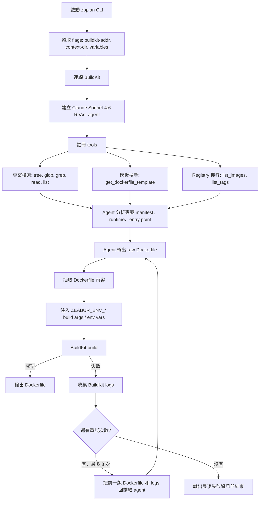

# zbplan

[English](README.md)

讓 AI 判斷、產生並自動迭代 Dockerfile。

`zbplan` 會把專案交給 agent 分析，讓它搜尋可用的 Dockerfile templates、Docker Hub / GHCR base images 與 image tags，產生 Dockerfile 之後再交給 BuildKit 實際編譯。編譯失敗的話，BuildKit logs 會回饋給 agent，讓它重新修正 Dockerfile。

實測 Claude Sonnet 4.6 可以在約 US$0.2 credit、1-2 round 的情況下完成 Dockerfile 的產生。Haiku 4.5 實測也可以在小於 3 個 round 完成 Dockerfile 的產生。

## Demo

[](https://asciinema.org/a/Tpy94oq5Re1KqPg4)

指令：

```bash
go run ./cmd/zbplan -context-dir /tmp/coscup-frontend-2026 -buildkit-addr "unix://$HOME/.lima/buildkit/sock/buildkitd.sock"
```

在 [COSCUP/2026](https://github.com/coscup/2026) 儲存庫下，搭配 [Zeabur AI Hub](https://zeabur.com/docs/zh-TW/ai-hub) 進行測試，成本價為 US$0.1946，耗時 2m48s。這個專案是 Nuxt.js 的靜態網站，zbplan 因此選擇了 NGINX，也正確在沒有額外提示的情況下，設定了 root directory 網址。

<details>

<summary>zbplan 生成的 Dockerfile</summary>

```dockerfile
FROM node:24-alpine3.22 AS builder
WORKDIR /app

RUN corepack enable pnpm

RUN --mount=type=cache,target=/root/.local/share/pnpm/store \
    --mount=type=bind,source=package.json,target=package.json \
    --mount=type=bind,source=pnpm-lock.yaml,target=pnpm-lock.yaml \
    --mount=type=bind,source=pnpm-workspace.yaml,target=pnpm-workspace.yaml \
    pnpm install --frozen-lockfile

COPY . .

RUN pnpm build

FROM nginx:1.28.3-alpine AS runtime

RUN rm /etc/nginx/conf.d/default.conf

COPY --from=builder /app/.output/public /usr/share/nginx/html/2026

RUN printf 'server {\n\
    listen 8080;\n\
    server_name _;\n\
    root /usr/share/nginx/html;\n\
\n\
    location /2026/ {\n\
        try_files $uri $uri/ /2026/index.html;\n\
    }\n\
\n\
    location = / {\n\
        return 301 /2026/;\n\
    }\n\
}\n' > /etc/nginx/conf.d/app.conf

RUN addgroup -S app && adduser -S app -G app \
    && chown -R app:app /usr/share/nginx/html \
    && chown -R app:app /var/cache/nginx \
    && touch /var/run/nginx.pid \
    && chown app:app /var/run/nginx.pid

USER app

EXPOSE 8080

CMD ["nginx", "-g", "daemon off;"]
```

</details>

## 背景

Hu et al. (2025) [^1] 已經試過了這個技巧：

- 先做出一個共同的 base，讓 agents 可以在上面做依賴安裝的實驗
- 依賴安裝完成後，跑 unit tests 確保可以正常執行
- 可以正常執行的話，生成一個 Dockerfile 可以用來編譯

Zeabur 打算基於這個方向做出改進：

1. 不預先做共同 base，而是透過 Registry API + fuzzy search 檢索版本，例如 `ubuntu:24.04`。如果不確定，則提供一串版本列表讓 AI 選擇。
2. Zeabur 主要面向 Web Services，因此最終採納條件可以從「unit tests 通過」改成「服務 port 可以連通」。目前這個 prototype 先用 BuildKit build 成功作為驗證條件。
3. 採用 cache mount 來防止重新安裝依賴的開銷，但同時允許 agent 直接修改整個 Dockerfile。

## 和先前 zbpack 的差異

- 有 few-shot LLM 介入，因此可以自動適應各式各樣的專案，而不需要人工撰寫決策邏輯。
- AI 可以搜尋 Docker Hub 和 `ghcr.io` 有哪些基礎 Docker Images，也可以模糊搜尋每個專案的 Dockerfile templates。
- AI 生成的 Dockerfile **會實際跑 BuildKit**，確認能不能編譯；不能編譯會打回去重新寫。
- 這次 AI 掌握了 cache mount、bind mount 和 multi-stage build。在 BuildKit 有正確配置快取的情況下，依賴只需要拉一次。

## 流程



## 主要元件

- `cmd/zbplan`: CLI entrypoint，建立 Claude ReAct agent，執行最多 3 次的「生成 Dockerfile → BuildKit 編譯 → 失敗修正」迴圈。
- `internal/plantools`: 提供 agent 可呼叫的工具，包括專案檔案檢索、Dockerfile template fuzzy search、registry image/tag search，以及 BuildKit client wrapper。
- `internal/plantools/dockerfiles`: 內建 Dockerfile templates，目前涵蓋 Bun、Deno、FastAPI、Go、Java Gradle、Java Maven、Next.js、Node npm、Node pnpm、PHP、Python pip、Python uv、Ruby、Rust、Static。
- `lib/registryutil`: 搜尋 Docker Hub / GHCR images，並用 fuzzy search 挑出符合版本需求的 tags。
- `lib/builder`: BuildKit builder，負責 Dockerfile 前處理、環境變數注入、build context 掛載與 build progress logging。

## 使用方式

需要先提供 Anthropic API key，並準備可連線的 BuildKit server：

```bash
ZBPLAN_ANTHROPIC_API_KEY=... \
nix develop --command go run ./cmd/zbplan \
  --buildkit-addr tcp://127.0.0.1:1234 \
  --context-dir /path/to/project
```

可以用 `--variables KEY=value` 傳入環境變數。這些變數會在 Dockerfile 每個 stage 的 `FROM` 後被注入成 `ARG ZEABUR_ENV_*` 與對應的 `ENV`。

## 開發

這個專案使用 Nix。所有 Go commands 都應該在 dev shell 裡執行：

```bash
nix develop --command go test ./...
nix develop --command go build ./...
```

Dockerfile template 的 integration tests 需要 Docker，會透過 testcontainers 啟動 BuildKit container：

```bash
nix develop --command go test -tags=integration -timeout=30m -count=1 ./internal/plantools/
```

加上 `-v` 可以看到完整 BuildKit logs：

```bash
nix develop --command go test -tags=integration -timeout=30m -count=1 -v ./internal/plantools/
```

[^1]: Hu, R., Peng, C., Wang, X., Xu, J., & Gao, C. (2025). Repo2Run: Automated building executable environment for code repository at scale. arXiv. https://doi.org/10.48550/arXiv.2502.13681
