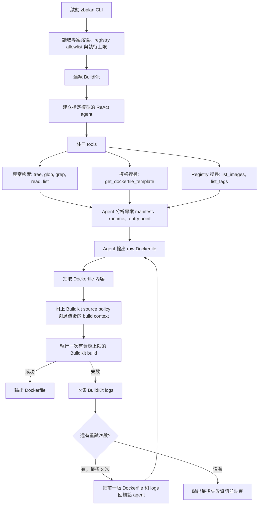

# zbplan

[English](README.md)

讓 AI 判斷、產生並自動迭代 Dockerfile。

`zbplan` 會把專案交給 agent 分析，讓它搜尋可用的 Dockerfile templates、Docker Hub / GHCR base images 與 image tags，產生 Dockerfile 之後再交給 BuildKit 實際編譯。編譯失敗的話，BuildKit logs 會回饋給 agent，讓它重新修正 Dockerfile。

實測 Claude Sonnet 4.6 和 OpenAI GPT-5.5 可以在約 US$0.2 credit、1-2 round 的情況下完成 Dockerfile 的產生。

## Demo

[](https://asciinema.org/a/w369RBjXfHpaJjfX)

指令：

```bash
# 啟動 buildkitd
docker run -d --name buildkitd --privileged moby/buildkit:latest

# 執行 zbplan
time go run ./cmd/zbplan -context-dir /Volumes/Dev/coscup/frontend-2026 -buildkit-addr "docker-container://buildkitd"
```

使用 [Zeabur AI Hub](https://zeabur.com/docs/zh-TW/ai-hub) 上 GPT 5.5 模型的預設設定，針對 [COSCUP/2026](https://github.com/coscup/2026) 儲存庫測試時，zbplan 嘗試 2 次後完成建置，耗時 1 分 58.165 秒，總成本為 US$0.1937。這個專案是 Nuxt.js 靜態網站，zbplan 在沒有任何額外提示的情況下，選用了[我們的 Caddy 伺服器發行版](https://github.com/zeabur/caddy-static)，並正確設定了 301 redirect。

<details>

<summary>zbplan 產生的 Dockerfile</summary>

```dockerfile
FROM node:24.9-alpine AS builder
WORKDIR /app

ENV COREPACK_ENABLE_DOWNLOAD_PROMPT=0

RUN corepack enable pnpm

RUN --mount=type=cache,target=/root/.local/share/pnpm/store \
    --mount=type=bind,source=package.json,target=package.json \
    --mount=type=bind,source=pnpm-lock.yaml,target=pnpm-lock.yaml \
    --mount=type=bind,source=pnpm-workspace.yaml,target=pnpm-workspace.yaml \
    pnpm install --frozen-lockfile --ignore-scripts

COPY . .

ENV NITRO_PRESET=static
RUN pnpm exec nuxt prepare && pnpm build

FROM zeabur/caddy-static:2.0 AS runtime

COPY --from=builder /app/.output/public /usr/share/caddy/2026

RUN cat <<'EOF' > /usr/share/caddy/_redirects
/  /2026/  301
EOF

EXPOSE 8080
```

</details>

## 背景

Hu et al. (2025) [^1] 已經試過了這個技巧：

- 先做出一個共同的 base，讓 agents 可以在上面做依賴安裝的實驗
- 依賴安裝完成後，跑 unit tests 確保可以正常執行
- 可以正常執行的話，生成一個 Dockerfile 可以用來編譯

Zeabur 打算基於這個方向做出改進：

1. 不預先做共同 base，而是透過 Registry API + fuzzy search 檢索版本，例如 `ubuntu:24.04`。如果不確定，則提供一串版本列表讓 AI 選擇。
2. Zeabur 主要面向 Web Services，因此最終採納條件可以從「unit tests 通過」改成「服務 port 可以連通」。目前這個 prototype 先用 BuildKit build 成功作為驗證條件。
3. 採用 cache mount 來防止重新安裝依賴的開銷，但同時允許 agent 直接修改整個 Dockerfile。

## 和先前 zbpack 的差異

- 有 few-shot LLM 介入，因此可以自動適應各式各樣的專案，而不需要人工撰寫決策邏輯。
- AI 可以搜尋 Docker Hub 和 `ghcr.io` 有哪些基礎 Docker Images，也可以模糊搜尋每個專案的 Dockerfile templates。
- AI 生成的 Dockerfile **會實際跑 BuildKit**，確認能不能編譯；不能編譯會打回去重新寫。
- 這次 AI 掌握了 cache mount、bind mount 和 multi-stage build。在 BuildKit 有正確配置快取的情況下，依賴只需要拉一次。

## 流程


```mermaid
flowchart TD
    A[啟動 zbplan CLI] --> B[讀取專案路徑、registry allowlist 與執行上限]
    B --> C[連線 BuildKit]
    C --> D[建立指定模型的 ReAct agent]
    D --> E[註冊 tools]

    E --> E1[專案檢索: tree, glob, grep, read, list]
    E --> E2[模板搜尋: get_dockerfile_template]
    E --> E3[Registry 搜尋: list_images, list_tags]

    E1 --> F[Agent 分析專案 manifest、runtime、entry point]
    E2 --> F
    E3 --> F

    F --> G[Agent 輸出 raw Dockerfile]
    G --> H[抽取 Dockerfile 內容]
    H --> I[附上 BuildKit source policy 與過濾後的 build context]
    I --> J[執行一次有資源上限的 BuildKit build]

    J -->|成功| K[輸出 Dockerfile]
    J -->|失敗| L[收集 BuildKit logs]
    L --> M{還有重試次數?}
    M -->|有，最多 3 次| N[把前一版 Dockerfile 和 logs 回饋給 agent]
    N --> G
    M -->|沒有| O[輸出最後失敗資訊並結束]
```

## 主要元件

- `cmd/zbplan`：CLI entrypoint，建立指定模型的 ReAct agent，並在設定的嘗試次數、步數與時間上限內執行 generate → build → fix 迴圈。
- `pkg/zbplan`：Agent orchestration 與 context budgeting。單次送入模型的 tool result 和 BuildKit retry logs 以 12 KiB 為上限；完整 tool result 只會保留在有總容量限制的 store 裡，且只有原先已被截斷的結果會在較早的 tool rounds 中壓縮成 reference。
  `read_tool_output` 分頁會保留在模型的對話紀錄中，不會再存入 output store，因此讀取分頁不會擠掉原始結果。
- `internal/plantools`：提供 agent 有明確工作量上限的專案檔案檢索、Dockerfile template fuzzy search、registry allowlist image/tag search，以及 BuildKit client wrapper。
- `internal/plantools/dockerfiles`：內建 Dockerfile templates，目前涵蓋 Bun、Deno、FastAPI、Go、Java Gradle、Java Maven、Next.js、Node npm、Node pnpm、Nuxt server、Nuxt static、PHP、Python pip、Python uv、Ruby、Rust、Static。
- `pkg/registryutil`：搜尋 Docker Hub / GHCR images，並用 fuzzy search 挑出符合版本需求的 tags。
- `pkg/builder`：BuildKit builder，負責附上 source policy、固定使用內建 Dockerfile frontend、過濾 build context、以 `RUN` secret 掛載 build variables，並回報 build progress。

## 使用方式

需要先提供 Anthropic API key，並準備可連線的 BuildKit server：

```bash
ZBPLAN_ANTHROPIC_API_KEY=... \
nix develop --command go run ./cmd/zbplan \
  --buildkit-addr tcp://127.0.0.1:1234 \
  --context-dir /path/to/project
```

Build policy 由 BuildKit daemon 強制執行，不靠比對 Dockerfile 文字：

- 每次 solve 都帶上 BuildKit [source policy](https://pkg.go.dev/github.com/moby/buildkit/sourcepolicy)：除了本機 build context 與 allowlist 內 registry 的 image，其餘來源一律拒絕。`FROM`、`COPY --from`、`RUN --mount from=`、base image 繼承的 `ONBUILD`、遠端 `ADD` URL 與 Git 來源都適用。Allowlist 預設為 `docker.io`、`ghcr.io`、`quay.io` 與 `gcr.io`，可用逗號分隔的 `--allowed-registries` 取代。Image 搜尋與 tag 查詢也使用同一份 allowlist。
- 固定使用 daemon 內建的 Dockerfile frontend，`# syntax` 指令無法載入外部 frontend image。
- 不授予任何 entitlement，BuildKit 會拒絕 `RUN --network=host` 與 `--security=insecure`。其他 `RUN` 指令使用 BuildKit 的預設 network。
- Build context 只包含 agent 檔案工具能讀取的檔案：被 `.gitignore` 忽略的路徑、預設的相依套件／快取目錄，以及 `.env*`、`.npmrc`、私鑰等憑證檔案都不會傳給 BuildKit。

zbplan 不會把 runtime secrets 或環境變數傳入 AI 產生的 build。

每次執行的上限為 `--max-build-attempts`（預設 3）、每次 generation 的 `--max-agent-steps`（預設 16，同時限制 model 請求與 tool 回合數）、`--run-timeout`（預設 15m），以及每次 BuildKit solve 的 `--build-timeout`（預設 10m）。

## 開發

這個專案透過 Nix 提供 Go 1.27.1，dev shell、套件建置與 Go Dockerfile template 都使用同一個版本。所有 Go commands 都應該在 dev shell 裡執行：

```bash
nix develop --command go test ./...
nix develop --command go build ./...
```

Dockerfile template 的 integration tests 需要 Docker，會透過 testcontainers 啟動 BuildKit container：

```bash
nix develop --command go test -tags=integration -timeout=30m -count=1 ./internal/plantools/
```

加上 `-v` 可以看到完整 BuildKit logs：

```bash
nix develop --command go test -tags=integration -timeout=30m -count=1 -v ./internal/plantools/
```

[^1]: Hu, R., Peng, C., Wang, X., Xu, J., & Gao, C. (2025). Repo2Run: Automated building executable environment for code repository at scale. arXiv. https://doi.org/10.48550/arXiv.2502.13681
